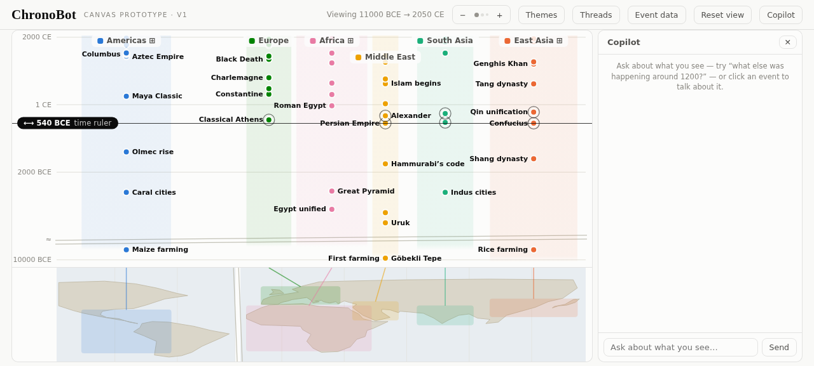
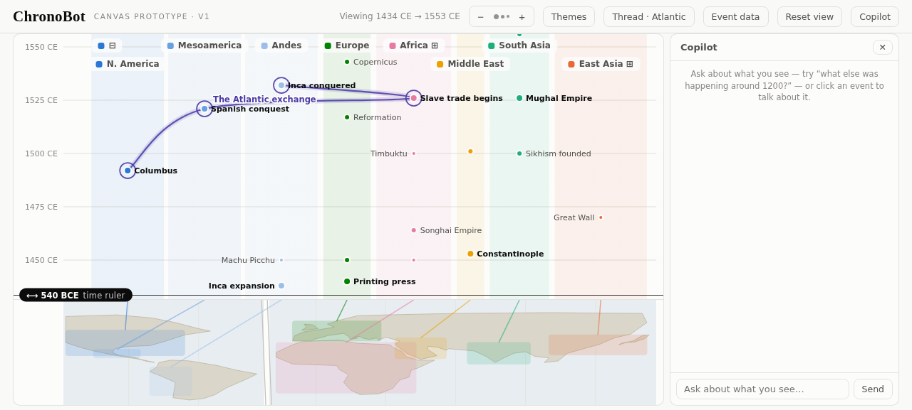

# ChronoBot

**A conversational Histomap** — an interactive synchronoptic chart of world history: a world map anchors space, civilization lanes rise through time, and an AI copilot curates, explains, and reshapes the view.



Any horizontal line through the canvas is one moment in time, everywhere at once: read across at any height for "meanwhile, what was happening everywhere else?", or drag the time ruler to ring every event at that moment. Zooming in reveals finer significance tiers. The copilot drives the whole view through tools while it narrates — and every action animates. The full product concept is in [CONCEPT.md](CONCEPT.md).

## What works today

- **The canvas** — [`prototype/canvas.html`](prototype/canvas.html), a single self-contained file: open it in any browser, no build, no server. Map-anchored lanes (with a 10× time-compressed Neolithic band below an honest axis break), semantic zoom by significance tier, a draggable time ruler, span capsules for events with duration, click-to-select.
- **Cross-lane threads** — curated chains of related events spanning lanes (the written word, the spread of Buddhism, the Mongol world, the Atlantic exchange), drawn as one path rising through time; the copilot can also compose dashed *ad-hoc* threads while narrating.
- **Lane splitting** — the Americas, Africa, and East Asia split into sub-region columns to compare developments within a continent: the Aztec and Inca empires rising simultaneously in separate columns, side by side.
- **The copilot** — a streamed chat with a hand-rolled agentic loop in the browser. It sees the current view state and the full dataset, and acts through eight view tools: zoom, time ruler, theme filter, highlights, curated and ad-hoc threads, lane splitting, reset.
- **The curated dataset** — 199 events across six lanes (11,000 BCE → today), 4 threads, 11 sub-region child lanes, governed by the [significance rubric](docs/significance-rubric.md). The copilot reads the dataset; it cannot write it.



## Quick start

**Canvas only** (zero dependencies): open [`prototype/canvas.html`](prototype/canvas.html) in a browser.

**With the copilot** (Node ≥ 20.12):

```sh
npm install
cp .env.example .env    # paste your DeepInfra API token into DEEPINFRA_TOKEN
npm start               # → http://localhost:8437
```

Inference runs on [DeepInfra](https://deepinfra.com)'s Anthropic-compatible Messages endpoint — default model DeepSeek V4 Flash ($0.09/$0.18 per MTok, 1M-token context), cheap enough that the whole dataset rides in every prompt. `CHRONOBOT_MODEL` swaps the model, `CHRONOBOT_BASE_URL` points at any other Anthropic-compatible provider, `PORT` moves the server. Without the server the canvas still works fully; only the chat is offline.

## Repository map

| Path | What it is |
|---|---|
| [`prototype/canvas.html`](prototype/canvas.html) | The whole app in one file — SVG canvas, chat panel, browser agentic loop, MCP host bridge — with the dataset inlined |
| [`prototype/build.mjs`](prototype/build.mjs) | Validates `data/` (taxonomy, lanes, children, threads) and re-inlines it into the canvas — `npm run build-data`, mandatory after any data edit |
| [`server.mjs`](server.mjs) | Thin dev server: serves the prototype, proxies the copilot chat (system prompt + tool schemas + SSE streaming), conversation-stateless |
| [`tools.mjs`](tools.mjs) | The shared view-tool registry — single source of truth for tool schemas; both servers derive from it |
| [`mcp-server.mjs`](mcp-server.mjs) | The parked MCP App variant (`npm run mcp`) — see below |
| [`data/`](data/) | The canon: `events.json`, `lanes.json` (with sub-region children), `threads.json`, `taxonomy.json` — curator-maintained, rubric-governed |
| [`docs/architecture.md`](docs/architecture.md) | **The living map** of how generation, tools, and data tiers work — kept in sync with reality by rule |
| [`docs/specs/`](docs/specs/) | Feature specs (BDD scenarios + Mermaid diagrams, status `Proposed → Agreed → Built`): threads, lane splitting, the MCP variant, the deferred promotion workflow |
| [`docs/significance-rubric.md`](docs/significance-rubric.md) | The editorial contract: what earns a place on the poster, and at which tier |
| [`docs/research/`](docs/research/) | Research handoffs — currently the open-data-sources survey for the upcoming dataset growth |
| [`BACKLOG.md`](BACKLOG.md) | The roadmap ledger: up next, parked (each with its trigger), shipped, decisions applied |
| [`CLAUDE.md`](CLAUDE.md) / [`AGENTS.md`](AGENTS.md) | The operating manual for coding agents — and a fine contributor guide for humans |

## How this project is developed

Spec-first, docs-never-trail-reality: new copilot tools are documented in the architecture registry before implementation, and major features get a spec in `docs/specs/` before code. The working rules — verification norms, data rules, architectural invariants, and the list of deliberately deferred ideas — live in [CLAUDE.md](CLAUDE.md). Start there before changing anything; start with [docs/architecture.md](docs/architecture.md) to understand how it works.

## License

Code is [MIT](LICENSE). The curated dataset is the author's original work and ships under the same terms for now; attribution handling will be revisited when third-party open data (CC BY sources like Cliopatria) is ingested — see [docs/research/data-sources.md](docs/research/data-sources.md).

## MCP App variant (parked)

ChronoBot doubles as an MCP server whose canvas renders *inside* MCP Apps-capable hosts (Claude Desktop, claude.ai, VS Code) — the host supplies the model, sessions, and its own knowledge tools. Real-host verdict: hosts render each tool call as a separate embedded snapshot, so this works as a distribution channel but inverts the product — the app ends up inside the chat rather than the chat inside the app. It still runs with `npm run mcp`; host setup and the full evaluation record live in [docs/specs/mcp-app.md](docs/specs/mcp-app.md). A CopilotKit-based harness ("Variant C") is the designated future path to a first-class app with an embedded copilot — see [BACKLOG.md](BACKLOG.md).
