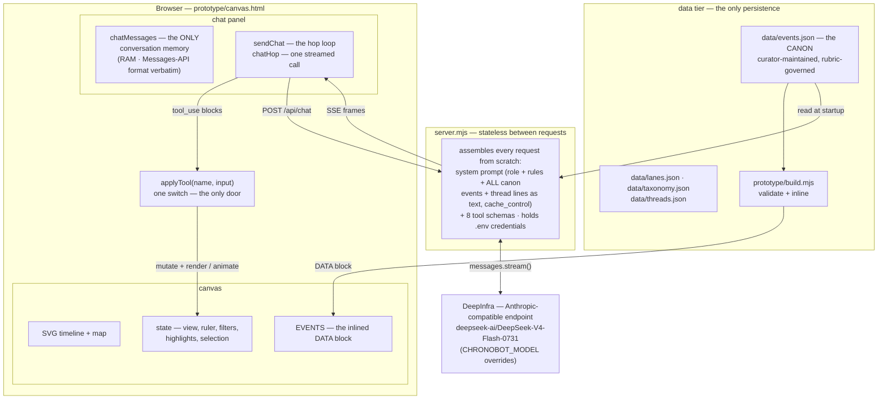
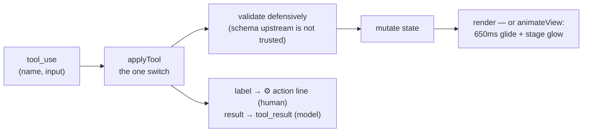
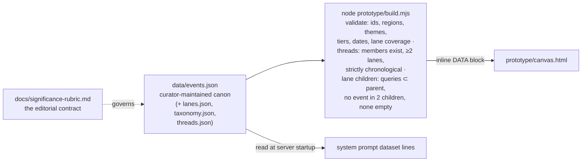
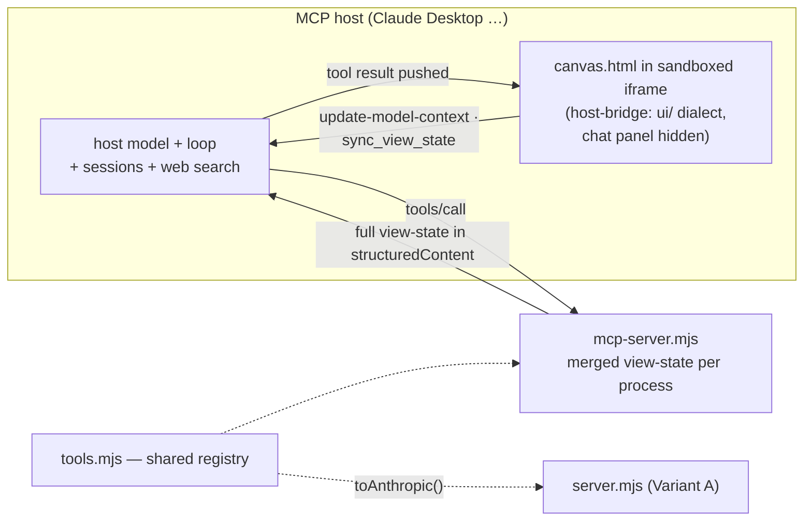

# ChronoBot — Architecture

*The living map of how generation works and how the copilot interacts with the UI.
Update this document in the same change that alters generation, tools, endpoints, or
data tiers. Feature specs live in `docs/specs/`; the editorial contract for data lives
in `significance-rubric.md`. Diagrams are Mermaid (rendered by GitHub and VS Code
preview). Last updated 2026-08-15.*

A deliberate choice frames everything here: **the agentic loop is hand-rolled and runs
in the browser**, because the tools *are* canvas mutations. We are experimenting with
agentic behavior designed to this use case; if we find ourselves rebuilding Claude
Code feature by feature, that is the signal to revisit the Agent SDK (see
[Invariants](#architectural-invariants), which keep that door open).

*Status note (2026-08-15): that signal partially fired — wanting host-grade knowledge
tools and sessions led to [`specs/mcp-app.md`](specs/mcp-app.md): an **MCP Apps
variant**, built (Phase A) and then **parked the same day** after the real-host
feel-test — hosts render each tool call as a separate embedded snapshot, turning
ChronoBot into a widget inside a chat rather than a first-class app with an
embedded chat. The custom variant this document describes is canonical; the
designated future harness for the first-class-app shape is a CopilotKit-based
**Variant C** (BACKLOG, spec required before build). The parked variant is
summarized in [MCP App variant](#mcp-app-variant-b--parked) below.*

## System map



Two principles fall out of this map:

- **The model's eyes are text.** It never sees pixels — it sees the `<view_state>`
  block prefixed to every user message, plus the dataset in its system prompt.
- **The model's hands are eight JSON schemas.** Every capability goes through
  `applyTool(name, input)`. There is no other channel: no DOM access, no eval, and —
  by an explicit 2026-08-15 decision — no writing to the dataset (see
  [Knowledge management](#knowledge-management--domain-map-and-deferral)).

## The generation cycle

One user turn = a loop of *hops*. One hop = one model call. The loop lives in
`sendChat()` (canvas.html); the cap is 6 hops per turn.

```mermaid
sequenceDiagram
    actor U as You
    participant B as Browser (canvas.html)
    participant S as server.mjs
    participant M as DeepInfra

    U->>B: type + Enter
    Note over B: chatMessages.push(user message =<br/>view_state + your text)
    loop up to 6 hops
        B->>S: POST /api/chat (full chatMessages)
        Note over S: assemble system prompt + 8 tool<br/>schemas — nothing remembered<br/>between requests
        S->>M: messages.stream()
        M--)S: text deltas
        S--)B: SSE frame — type "text"
        Note over B: words appear in a live bubble
        M-->>S: final message
        S-->>B: SSE frame — type "done"<br/>(content, stop_reason)
        Note over B: chatMessages.push(assistant message)
        alt stop_reason is tool_use
            Note over B: applyTool() per block — canvas<br/>animates, "⚙" action lines appear;<br/>tool_results pushed as a user<br/>message → next hop
        else end_turn or refusal
            Note over B: turn complete
        end
    end
```

### The SSE frame protocol (`POST /api/chat`)

The server responds `text/event-stream`; each frame is one line of
`data: <json>` followed by a blank line:

| frame `type` | payload fields            | meaning                                        |
|--------------|---------------------------|------------------------------------------------|
| `text`       | `text`                    | a delta — append to the live bubble            |
| `done`       | `content`, `stop_reason`  | the complete final message; `tool_use` blocks (if any) ride here |
| `error`      | `error`                   | terminal failure mid-stream                    |

Pre-stream failures (bad body, missing credentials) return plain
`application/json` `{ "error": … }` instead — the client checks the content-type
and treats a JSON body as either an error or, if it carries `content`, a whole
non-streamed message (backcompat with a pre-streaming server).

### Worked example (captured live, 2026-08-15)

The request message of hop 1 — note the view-state prefix, the model's entire
"sight" (one field per line):

```text
<view_state>
Visible: 11000 BCE to 2050 CE
Detail tiers shown: 1-1
Theme filter: all
Time ruler: 540 BCE
Highlighted: none
No event selected
</view_state>

In one short sentence, what is the oldest event on the canvas?
```

The actual response frame — the model answered by *doing* (no text at all):

```json
{
  "type": "done",
  "content": [
    {
      "type": "tool_use",
      "id": "chatcmpl-tool-9ba1…",
      "name": "highlight_events",
      "input": { "ids": ["jomon-pottery"] }
    }
  ],
  "stop_reason": "tool_use"
}
```

The browser highlighted Jōmon pottery (correct — c. 10,500 BCE) and pushed this
tool result as a user message, wrapped for readability here:

```json
{
  "role": "user",
  "content": [
    {
      "type": "tool_result",
      "tool_use_id": "chatcmpl-tool-9ba1…",
      "content": "ok — highlighted: jomon-pottery"
    }
  ]
}
```

Hop 2 then produced the one-sentence spoken answer.

### What the model perceives

The system prompt is a single text block (`cache_control: ephemeral`), assembled
fresh at server startup:

1. Role: copilot beside a synchronoptic chart; the lane list.
2. The `<view_state>` contract (what the per-message prefix means).
3. Tool-usage doctrine: *prefer showing over telling*.
4. **The full canon** — one line per event:
   `id | date | title | region | tier | themes` — plus one line per curated
   thread: `id | title | member ids in order`, the thread doctrine (prefer
   `show_thread` when a curated thread fits; `connect_events` draws a dashed
   ad-hoc suggestion and adds nothing to the dataset), and the lane-splitting
   doctrine (which lanes split into which children; split before comparing
   within a continent, since same-lane events stack in one column).
5. Grounding rules — reference/highlight by id; the dataset is fixed and curated;
   the model cannot add to it.
6. Style — plain conversational prose, no markdown (the sidebar renders raw text).

`<view_state>` fields (built by `viewStateText()` per message): visible year range ·
detail tiers shown · theme filter · ruler year · highlighted ids · active thread
(title + member count, "(ad-hoc)" when copilot-composed) · split lane (name +
child names) · selected event (id + title) or "No event selected". Clicking an
event on the canvas is UI→model deixis: it changes only this block.

## The tool registry

Every tool runs the same pipeline:



Camera/ruler moves glide (log-space zoom, `prefers-reduced-motion` respected,
canceled by any direct manipulation); glides issued in the same tool batch
**merge into one tween** (a ruler move no longer cancels a zoom in flight);
every tool batch pulses the stage border.
Adding a tool means adding a row here **before** implementation (see CLAUDE.md).

### set_theme_filter

| aspect     | behavior |
|------------|----------|
| input      | `themes: string[]` (enum of theme ids) |
| validation | unknown ids dropped silently; empty list = clear the filter |
| mutation   | `state.themes` replaced |
| motion     | instant render — a filter is a cut, not a camera move |
| result     | the active set, or "theme filter cleared" |

### zoom_to_range

| aspect     | behavior |
|------------|----------|
| input      | `start_year`, `end_year` (integers, negative = BCE) |
| validation | clamped to [−11000, 2050]; swapped if reversed |
| mutation   | years → u-units (deep past is 10× compressed below 4000 BCE); span = max(20u, range) × 1.15 pad; ppy clamped [fit … 3]; target `viewLo` centers the range |
| motion     | `animateView` glide |
| result     | "ok — now showing detail tiers 1-N" — semantic-zoom feedback telling the model what detail just became visible |

### set_time_ruler

| aspect     | behavior |
|------------|----------|
| input      | `year` (integer) |
| validation | clamped to [−11000, 2050] |
| mutation   | ruler year (tweened in u-space) |
| motion     | `animateView` glide |
| result     | "ok — ruler at <year>" |
| note       | the render rings every event the ruler touches: points within ±20px, spans wherever the ruler crosses the capsule — the "meanwhile, elsewhere" gesture |

### highlight_events

| aspect     | behavior |
|------------|----------|
| input      | `ids: string[]` |
| validation | partitioned into known / unknown ids |
| mutation   | `state.highlights` **replaced** with the known set; `hlNew` flags a one-shot entry pop |
| motion     | pop-in, then continuous pulse |
| result     | highlighted ids, plus "unknown ids: …" so the model can self-correct |
| note       | forced visibility — highlighted events bypass the tier cutoff AND the theme filter, and win label placement priority; the copilot can always point at what it discusses |

### show_thread

| aspect     | behavior |
|------------|----------|
| input      | `id: string` (enum of curated thread ids from threads.json) |
| validation | unknown id → error result listing valid ids; no state change |
| mutation   | `state.thread = {kind:'curated', id}` — one slot, replaces any active thread |
| motion     | glide to fit the thread's span **with top headroom** (the newest member clears the lane-header band so its label places), then a past→present draw-on wipe once the glide settles |
| result     | `ok — thread "<title>": N events, <start> → <end>` |
| note       | members get forced visibility (bypass tier cutoff + theme filter) and a thread ring, lighter than a highlight; solid path = canon (spec: [cross-lane-threads](specs/cross-lane-threads.md)) |

### connect_events

| aspect     | behavior |
|------------|----------|
| input      | `ids: string[]`, `label: string` |
| validation | deduped, partitioned known/unknown; < 2 known → error, no state change; known ids sorted chronologically client-side (the model need not know dates) |
| mutation   | `state.thread = {kind:'adhoc', ids, label}` — same single slot |
| motion     | same glide-to-fit + draw-on (fade — a dashed path can't wipe) |
| result     | `ok — connected N events as "<label>" (ad-hoc)` + unknown-id feedback |
| note       | **dashed** styling marks a model-composed narrative gesture, not canon; writes view state only — the knowledge-management deferral is untouched |

### split_lane

| aspect     | behavior |
|------------|----------|
| input      | `lane: string` (enum of splittable lane ids: americas, africa, east-asia) · `split: boolean` |
| validation | unknown or child-less lane → error listing splittable ids; no state change; `split:false` on an unsplit lane → gentle ok |
| mutation   | `state.splitLane = lane` (single slot — replaces any other split) or `null` |
| motion     | slot widths tween (~450ms): the lane borrows ≈2.4× width and slides apart into equal child columns, neighbors compress; map swaps to child territory boxes + per-child leader lines |
| result     | `ok — Americas split into North America · Mesoamerica · Andes (7 · 11 · 10 events)` / `ok — <name> collapsed into one lane` |
| note       | events land in child columns via `_sub` (precomputed); genuinely continent-wide events center on the whole stretch; header ⊞/⊟ affordances drive the same state (spec: [lane-split](specs/lane-split.md)) |

### reset_view

| aspect     | behavior |
|------------|----------|
| input      | none |
| mutation   | clears theme filter + highlights + thread + lane split — **not** the selection (selection belongs to the user, not the view); full time span; ruler → 540 BCE |
| motion     | `animateView` glide |
| result     | "ok" |

## Data tier



The canon is edited by humans only, governed by the rubric, and validated by
`build.mjs` after every edit. The model reads it; nothing at runtime writes it.

### Knowledge management — domain map and deferral

Knowledge management spans **all** knowledge the app uses, not just dataset
writes. The layers and channels, as they exist today:

| layer / channel          | today |
|--------------------------|-------|
| canon (curator channel)  | `data/*.json`, hand-authored under the rubric — the only write path |
| governance               | `significance-rubric.md` — entry bar, tiers, vetting standard |
| representation           | the event schema; `sources` and `vetted` are placeholders until the data pass |
| delivery to the model    | dataset lines in the system prompt (Variant A); `query_events` + dataset resource (Variant B) |
| the model's own knowledge| ungoverned narration, constrained by prompt rules to reference canon ids |
| retrieval channel        | none yet — web search / knowledge bases arrive with Variant C (BACKLOG) |
| AI-write channel         | **deferred** — see below |

What was deferred 2026-08-15 is the **AI-write channel only**: realtime,
copilot-driven dataset growth (`add_events` v1, built 2026-07-25, retired) and
its promotion workflow. How AI-proposed knowledge enters, is vetted, and
graduates merits a design done at the level of this whole table — not a bolt-on
tool — and isn't needed yet. The experiment's record, scenarios, and reopening
criteria live in [`specs/promotion-workflow.md`](specs/promotion-workflow.md)
(status: Deferred). A unified knowledge-management design has no spec yet;
when it's time, it gets one.

## HTTP surface

| route               | method | body / response |
|---------------------|--------|-----------------|
| `/`, `/canvas.html` | GET    | the prototype (read fresh from disk per request) |
| `/api/chat`         | POST   | `{ messages }` → SSE frames (protocol above); plain JSON `{ error }` on pre-stream failure |

The server is a localhost personal tool: no auth, permissive by design.

## MCP App variant (B) — parked

Built 2026-08-15 (Phase A) and **parked 2026-08-15** after the Claude Desktop
feel-test: hosts render each tool call as a separate embedded snapshot (fresh
iframe per call), so motion continuity is lost and the app is embedded in the
chat instead of the chat in the app — supersession criteria 1 & 5 fail on host
behavior we don't control. Full verdict in [`specs/mcp-app.md`](specs/mcp-app.md).
It remains a working zero-obligation distribution channel: the same
`canvas.html` doubles as an MCP App — `mcp-server.mjs` (stdio) serves it as a
`ui://` resource and exposes the shared view tools plus `show_canvas`,
`query_events`, a dataset resource, and the app-only `sync_view_state`; the host
supplies the model, loop, sessions, and knowledge tools. The keepers — the
`tools.mjs` shared registry and the full-state-result pattern — outlive the
variant.



Design notes that differ from Variant A: tool results carry the **full merged
view state**, not deltas (correct under both host behaviors — routing to the live
canvas instance, or spawning a fresh iframe per tool call); the canvas reports
user-driven state back via the app-only `sync_view_state` tool and
`ui/update-model-context` (the `<view_state>` equivalent, deferred by the host to
the next user message); embedded mode is detected by a 2-second `ui/initialize`
probe, so plain-iframe embeds (the published artifact) fall back to full
standalone behavior.

## Architectural invariants

These keep the hand-rolled loop swappable for the Agent SDK (or anything else that
speaks the Messages API) if we ever converge on reinventing Claude Code:

1. **`chatMessages` stays literal Messages-API format** — role/content blocks,
   `tool_use`/`tool_result` pairs by id. Never a bespoke conversation object.
2. **One registry.** Every canvas capability is an `applyTool(name, input)` case
   with a JSON-schema'd input, defined once in the shared registry `tools.mjs`
   (both servers derive from it). No side doors (the `window.chronobot` debug
   handle calls the same entry point).
3. **The server stays conversation-stateless.** Future persistence serializes the
   standard message array (+ a canvas-state snapshot), nothing fancier.
4. **Prompt content lives in files** (dataset, rubric, style rules) spliced in at
   startup — portable to skills/CLAUDE.md-style content under any harness.
5. **Documented migration path for the loop:** under an SDK the loop moves
   server-side and canvas tools become bridged calls over the SSE channel
   (server pushes tool call → browser applies → posts result back). The tool
   implementations, view-state contract, and prompts carry over unchanged.

## Known limits (accepted for now)

- 6-hop cap per turn — a long orchestration can stall mid-story.
- One conversation, in RAM — reload loses it (sessions are a future spec).
- The model cannot modify the dataset — deferred by design, not an oversight.
- The model sees event *lines*, not full records (no lat/lon, no sources yet).
