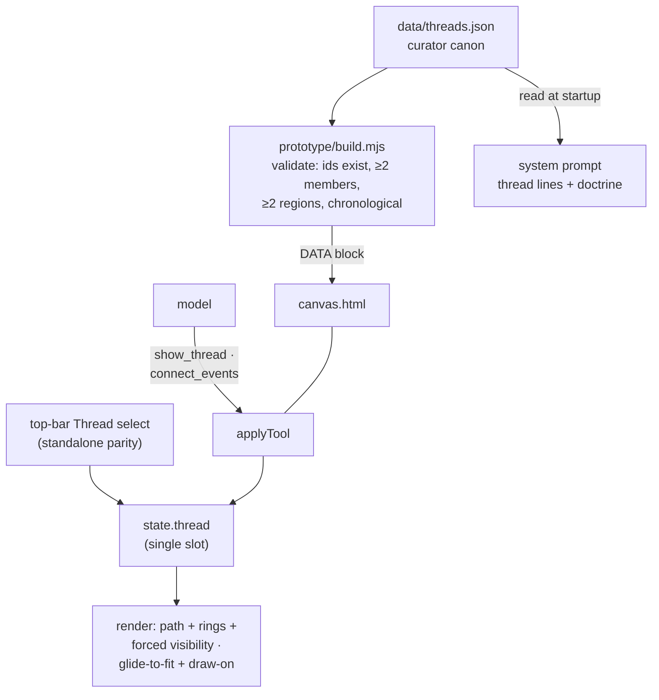
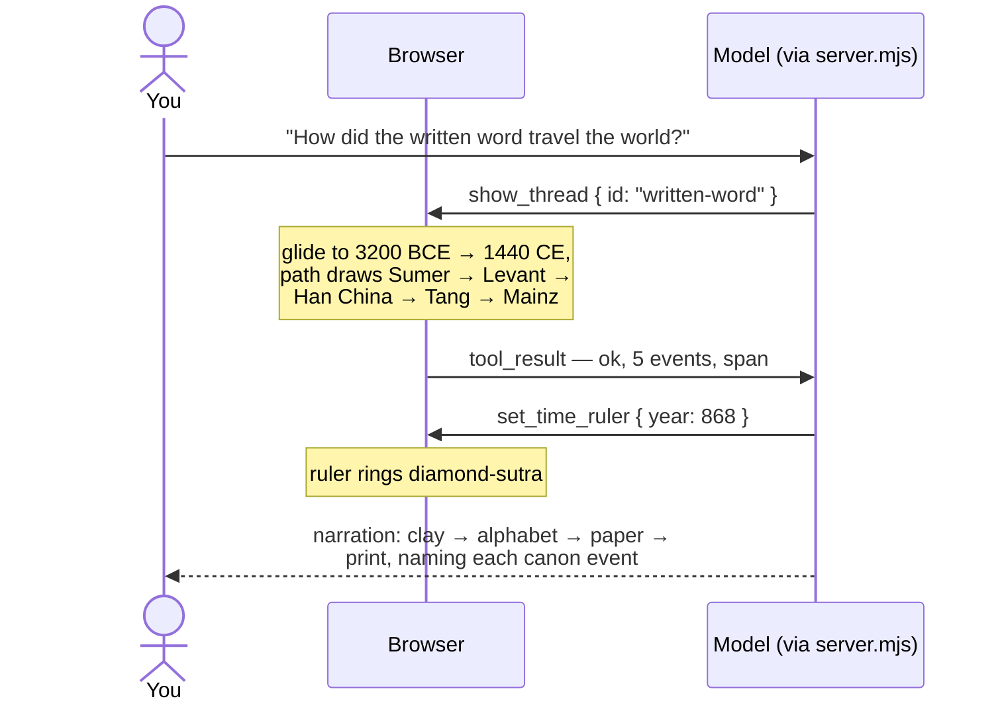

# Spec — Cross-lane threads

**Status: Agreed (2026-08-15) → Built (2026-08-15)**
Related: [architecture.md](../architecture.md) → tool registry ·
[significance-rubric.md](../significance-rubric.md) (thread-entry bar noted
below) · BACKLOG.md → Shipped.

*Build verification record (2026-08-15):* `build.mjs` validates and inlines the
4 seed threads (guardrails exercised: chronology, cross-lane, unknown members
all error correctly during authoring). Browser-verified via agent-browser
screenshots: `show_thread` glides-with-headroom and draws the written-word path
with all 5 members ringed **and labeled** (the headroom fit exists because the
plain centered fit parked the newest member under the lane-header band, where
the label-collision system dropped its label); `connect_events` with unordered
ids + one unknown id drew the dashed "Plague routes" path chronologically and
reported the unknown id; too-few-ids and unknown-thread-id errors leave state
untouched; thread members render under a non-matching theme filter (5 rings
under `war`); `reset_view` clears the thread; the top-bar picker drives the
same state (Mongol world via click). Live two-prompt DeepInfra run: "How did
the written word travel?" → hop 1 `show_thread {written-word}`, hop 2
narration by canon ids + `highlight_events` of all 5 members; "Connect the
dots between the fall of Constantinople, Columbus, and the printing press" →
`connect_events` labeled "Age of Discovery & print" + highlights + zoom in one
hop. *Implementation notes:* curve control points are clamped into each
segment's bounding box (no sideways overshoot past a lane; same-lane runs stay
vertical); the draw-on plays after the glide settles (mid-glide repaints hold
the CSS animation at progress 0); the thread title flips to end-anchor near
the right edge; ad-hoc labels cap at 60 chars. Thread-entry bar applied to the
seeds: a connection historians actually narrate, members already canon.

## Why

Lanes show what happened *within* a civilization; the synchronoptic promise is
also about what moved *between* them — writing, faiths, goods, plagues,
conquests. Today the copilot can only gesture at a connection with prose and
scattered highlights; nothing on the canvas draws the Silk Road or traces
printing from Tang woodblocks to Gutenberg. Threads make the connection itself
a first-class, visible object: an ordered chain of canon events spanning two or
more lanes, drawn as one path rising through time — the signature move no
single lane can show.

## Design

### Data model — `data/threads.json` (curator canon)

Threads are canon, curator-authored under the rubric, exactly like events. The
model cannot create or edit them (the knowledge-management AI-write channel
stays deferred). Schema, one thread:

```json
{
  "id": "written-word",
  "title": "The written word",
  "short": "Writing",
  "summary": "How durable writing was invented, alphabetized, papered, and pressed.",
  "members": [
    "writing-invented",
    "alphabet-spreads",
    "papermaking",
    "diamond-sutra",
    "printing-press"
  ],
  "themes": ["ideas"]
}
```

`build.mjs` validation (errors, not warnings): unique thread ids · every member
id exists in canon · ≥ 2 members · members span ≥ 2 regions (cross-lane by
definition) · members strictly chronological by start year (curator intent,
not auto-sorted). Threads inline into the canvas DATA block and become one
line each in the system prompt:
`thread: written-word | The written word | 5 events | -3200 → 1440`.

Proposed seed set (membership finalized at data-authoring time, validated by
build): **written-word** (as above) · **spread-of-buddhism** (buddha → ashoka →
kushan-empire → buddhism-china → diamond-sutra) · **mongol-world**
(genghis-khan → baghdad-sacked → yuan-dynasty → black-death → timur) ·
**atlantic-exchange** (columbus → cortes-conquest → pizarro-conquest →
slave-trade). Entry bar (rubric addendum when Built): a connection historians
actually narrate, not a theme coincidence; every member already canon.

### Canvas state and rendering

One active thread at a time — a single slot, replaced on each thread call:

```js
state.thread =
  null
  | { kind: "curated", id }
  | { kind: "adhoc", ids, label }
```

- **Path:** a smooth curve through member anchor points in member order
  (bottom → top; time direction is inherent since past is at bottom). Anchor =
  the event's dot; for spans, the capsule's start point.
- **Styling:** curated = solid stroke with a soft glow; ad-hoc = **dashed** —
  the visual contract that this is a model-composed narrative gesture, not
  canon. Title/label chip sits at the path's midpoint.
- **Entry animation:** the path draws on past → present (~800ms) after the
  camera glide; skipped under `prefers-reduced-motion`.
- **Forced visibility:** thread members bypass the tier cutoff and the theme
  filter (same rule as highlights) and get a small thread-colored ring —
  lighter than the highlight pulse, so the two emphases read differently and
  can coexist on the same event.
- **Standalone parity:** a compact "Thread" select in the top bar (None + the
  curated titles) drives the same state — the canvas keeps working fully
  without the copilot.

### New tools (shared registry `tools.mjs`; documented here first, moved into
architecture.md's registry when Built)

Both tools end with the same motion: glide-to-fit the thread's full time span
(padded, like `zoom_to_range`), then the draw-on — so "show me the Silk Road"
is one call, not a zoom-then-draw pair.

#### show_thread

| aspect     | behavior |
|------------|----------|
| input      | `id: string` — enum of curated thread ids (generated from threads.json, like theme ids) |
| validation | unknown id → error result listing valid ids; **no state change** |
| mutation   | `state.thread = { kind: "curated", id }` — replaces any active thread |
| motion     | glide to fit the thread's span, then draw-on |
| result     | `ok — thread "The written word": 5 events, 3200 BCE → 1440 CE` |
| note       | members forced visible (tier + theme bypass) |

#### connect_events

| aspect     | behavior |
|------------|----------|
| input      | `ids: string[]`, `label: string` |
| validation | ids deduped, partitioned known/unknown; **≥ 2 known required** else error, no state change; known ids sorted chronologically (deterministic — the model need not know dates) |
| mutation   | `state.thread = { kind: "adhoc", ids: sortedKnown, label }` — replaces any active thread |
| motion     | glide to fit, then draw-on (dashed) |
| result     | `ok — connected 4 events as "Plague routes" (ad-hoc)` + `unknown ids: …` when applicable |
| note       | writes **view state only** — a narrative gesture at the same trust level as chat prose; dashed styling signals non-canon; the knowledge-management deferral is untouched |

#### reset_view (amended)

Clears the active thread in addition to filter + highlights (a thread is view
state; selection still belongs to the user and survives).

### What the model perceives

`viewStateText()` gains one line: `Thread: The written word (5 events)` ·
`Thread: "Plague routes" (ad-hoc, 4 events)` · `Thread: none`. The system
prompt gains the thread lines (above) plus one doctrine sentence: *prefer
`show_thread` when a curated thread fits; use `connect_events` for ad-hoc
connections you are narrating — it draws a suggestion, it does not add
knowledge.*

## Dataflow





## Features and scenarios

```gherkin
Feature: Curated threads
  Scenario: Show a thread in one call
    When the model calls show_thread with id "written-word"
    Then the camera glides to fit 3200 BCE through 1440 CE
    And a solid path draws past-to-present through the 5 members
    And all members are visible regardless of tier cutoff or theme filter
    And the result reports the title, member count, and span

  Scenario: Unknown thread id
    When the model calls show_thread with id "spice-route"
    Then no state changes
    And the result lists the valid thread ids so the model can self-correct

  Scenario: Threads replace, never stack
    Given thread "written-word" is active
    When the model calls show_thread with id "mongol-world"
    Then "mongol-world" is the only active thread

  Scenario: Standalone parity via the picker
    Given the canvas is open with no server
    When the user picks "The written word" in the Thread select
    Then the same glide, draw-on, and forced visibility occur
    And picking "None" clears the thread

Feature: Ad-hoc connections (connect_events)
  Scenario: The copilot composes a connection
    When the model calls connect_events with 4 known ids and label "Plague routes"
    Then a dashed path draws through them in chronological order
    And the label chip reads "Plague routes"
    And the result says "(ad-hoc)"

  Scenario: Unknown ids are reported, known ones proceed
    When connect_events receives 3 known ids and 1 unknown id
    Then the thread draws through the 3 known events
    And the result names the unknown id

  Scenario: Too few known ids
    When connect_events receives 1 known id and any unknowns
    Then no state changes
    And the result explains at least 2 known events are required

  Scenario: Unordered input is safe
    When connect_events receives known ids in non-chronological order
    Then the path still draws in chronological order

Feature: Interplay with existing state
  Scenario: Thread and highlights coexist
    Given thread "mongol-world" is active
    When the model highlights "black-death"
    Then black-death shows both the thread ring and the highlight pulse

  Scenario: Theme filter does not hide thread members
    Given the theme filter is set to "war"
    When thread "written-word" is shown
    Then its members render even though none carry the war theme

  Scenario: reset_view clears the thread
    Given any thread is active
    When the model calls reset_view
    Then the thread, highlights, and theme filter are cleared
    And the user's selection is preserved

  Scenario: Reduced motion
    Given the user prefers reduced motion
    When any thread is shown
    Then the view snaps and the path appears without the draw-on animation

Feature: Build-time guardrails (curator channel)
  Scenario: A thread referencing a missing event fails the build
    Given threads.json contains a member id not in events.json
    When node prototype/build.mjs runs
    Then it exits with an error naming the thread and the bad id

  Scenario: A single-lane thread fails the build
    Given a thread whose members all share one region
    Then the build rejects it — threads are cross-lane by definition

  Scenario: Non-chronological members fail the build
    Given a thread whose members are out of start-year order
    Then the build rejects it rather than silently sorting canon
```

## Out of scope (this version)

- **Branching / network threads** — spread-of-agriculture is a tree, the Silk
  Road is honestly a network; v1 draws a single chronological polyline and
  curators pick linear-ish chains. Revisit with usage.
- **Multiple simultaneous threads / comparison view** — one slot only.
- **A dedicated clear_thread tool** — reset_view and the picker cover clearing;
  add only if usage shows the model needs to drop a thread while keeping the
  rest of the view.
- **Per-link annotations** (edge labels like "carried west after Talas") — the
  copilot narrates links in prose for now.
- **AI-authored curated threads** — that is the knowledge-management AI-write
  channel, deferred (`promotion-workflow.md`); `connect_events` deliberately
  stops at ephemeral view state.
- **Variant B exercise** — the new tools land in the shared registry, so the
  parked MCP server inherits them for free, but nothing is verified there
  (zero-obligation per its parked status).
