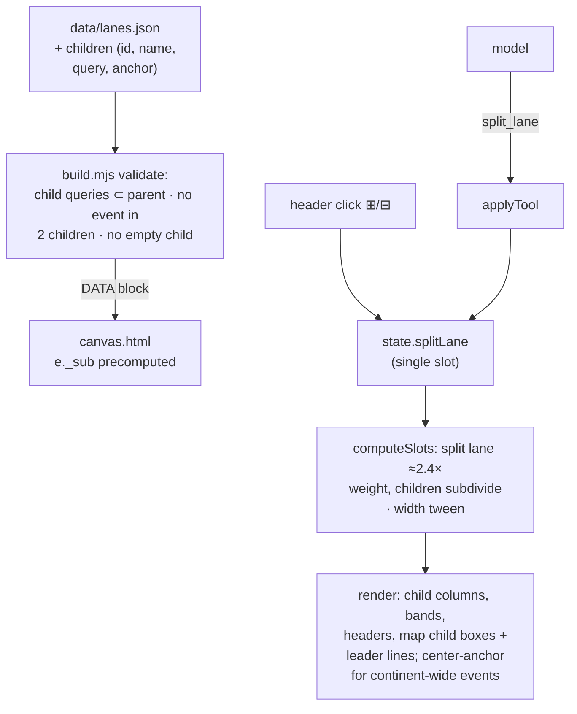
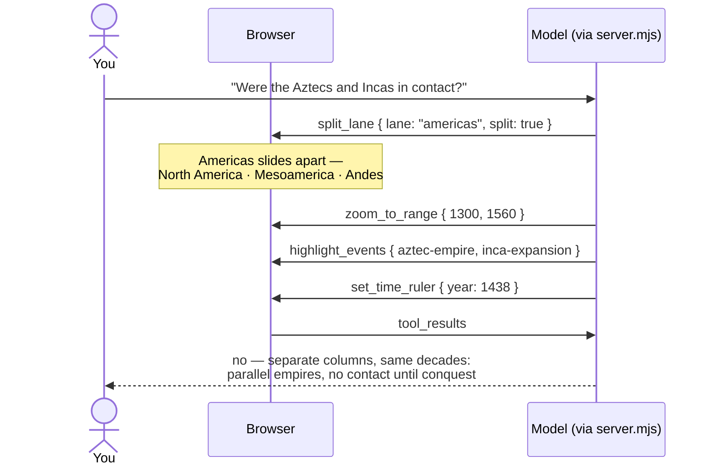

# Spec — Lane splitting (aggregation, v1)

**Status: Agreed (2026-08-16) → Built (2026-08-16)**

*Build verification record (2026-08-16):* build guardrails green over the
authored children (11 child lanes across 3 parents). Browser-verified via
agent-browser: split renders child columns, bands, headers, dots in family
hues, and per-child map boxes + leader lines; the Aztec/Inca flagship scenario
(split + zoom 1300–1560 + ruler 1438 + highlights) shows the two empires side
by side in separate columns; single-slot replacement (Africa split collapses
Americas), collapse, unsplittable/unknown-lane errors (no state change), and
header ⊞/⊟ clicks all pass; the atlantic-exchange thread re-anchors through
child columns while split and back on collapse; `<view_state>` carries the
Split-lane line alongside Thread. Live DeepInfra run: "Were the Aztecs and the
Incas ever in contact?" → one hop with `set_time_ruler 1438` +
`zoom_to_range 1300–1550` + `split_lane americas`, then highlights — after a
doctrine strengthening (see below).

*Implementation deviations (all deliberate):* the parent group label became a
compact **⊟ merge pill at the stretch's left edge** — a full "Name ⊟" pill
shares its center with a child header and loses the two-row stagger fight;
child columns divide the stretch **equally** (lon-proportional widths would
hand North America most of the space); the prompt doctrine explicitly names
the stacking problem ("aztec-empire and inca-expansion nearly overlap at world
zoom — split before comparing"), which the live test showed is what actually
triggers the tool. Two side fixes shipped with the build: sequential
`animateView` calls in one tool batch now **merge into a single glide** (a
ruler move used to cancel a zoom in flight — latent since streaming), and the
`window.chronobot` debug handle exposes read-only `viewStateText` for testing.
Related: [architecture.md](../architecture.md) → tool registry ·
the lane-grain decision and pragmatic geo-ordering in BACKLOG → Decisions ·
roadmap item 1 in [BACKLOG.md](../../BACKLOG.md) ("aggregation /
split-on-zoom").

## Why

The 2026-07-24 merge to six continental lanes was explicitly framed as the
coarse level of an aggregation hierarchy, with known costs accepted on credit:
Mesoamerica↔Andes independence is invisible at world zoom, Egypt reads as
generic "Africa", and China/Japan/steppe/Southeast Asia share one column. This
spec pays that debt: a lane with children can **split** into its sub-region
columns — Americas into North America · Mesoamerica · Andes, Africa into its
four regions, East Asia into Steppe · China · Japan · Southeast Asia — so the
canvas can show that the Aztec and Inca empires rose simultaneously with no
contact, in separate columns, without permanently spending six more columns of
poster width.

## Design decisions (the ones that shape everything)

1. **Splitting is explicit, not automatic.** The ledger name says
   "split-on-zoom", but v1 splits on *intent*: a click on a splittable lane
   header, or the copilot's `split_lane` tool. Automatic splitting at a ppy
   threshold would thrash the layout mid-glide, split all lanes when you care
   about one, and take the gesture away from the copilot. Auto-gating by zoom
   remains a possible v2 refinement (noted out of scope).
2. **One lane split at a time** — a single slot, like the thread slot.
   Splitting a second lane collapses the first. Keeps the layout readable and
   the state legible to the model; multi-split is out of scope.
3. **The split lane borrows width.** This is the "horizontal zoom": the split
   lane's stretch grows (≈2.4× weight in the slot computation) and the other
   lanes compress proportionally. Child columns subdivide the enlarged stretch
   in curated display order (roughly north → south reading left → right).
4. **Geography stays honest via the map, not the columns.** The map never
   rescales. When a lane splits, its single territory box is replaced by the
   children's authored lat×lon boxes, and each child column gets its own
   leader line — the same mechanism that already carries the pragmatic
   reorder's decoupling.
5. **Continent-wide events anchor at the split stretch's center.** Three canon
   events are genuinely trans-regional (`latin-independence`,
   `berlin-conference`, `year-of-africa`); when their lane splits they render
   centered across the children, not forced into a wrong child.
6. **Children are lanes** — same shape as top lanes (id, name, query, anchor),
   nested under a parent in `lanes.json`. Splittable today: Americas (3),
   Africa (4), East Asia (4). Europe, Middle East, and South Asia have no
   taxonomy children yet — their split arrives with the roadmap-item-3
   taxonomy work, not this build.

## Data model — `children` in `data/lanes.json`

```json
{
  "id": "americas",
  "name": "Americas",
  "query": { "regions": ["americas"] },
  "anchor": { "lon0": -106, "lon1": -63, "lat0": -35, "lat1": 28 },
  "children": [
    {
      "id": "americas-north",
      "name": "North America",
      "query": { "regions": ["americas.north"] },
      "anchor": { "lon0": -117, "lon1": -66, "lat0": 17, "lat1": 50 }
    },
    {
      "id": "americas-meso",
      "name": "Mesoamerica",
      "query": { "regions": ["americas.mesoamerica"] },
      "anchor": { "lon0": -105, "lon1": -85, "lat0": 14, "lat1": 25 }
    },
    {
      "id": "americas-andes",
      "name": "Andes",
      "query": { "regions": ["americas.andes"] },
      "anchor": { "lon0": -81, "lon1": -63, "lat0": -35, "lat1": 2 }
    }
  ]
}
```

`build.mjs` validation (errors): child ids unique; every child region query is
a strict subset of the parent's prefixes; no event matches two children of one
parent; each child matches ≥ 1 event. Events matching the parent but no child
(the three above) are legal — the center-anchor rule handles them.

Canvas precomputes `e._sub` (the child lane index within its parent, if any)
once at load; rendering picks the active column: child slot when the parent is
split, parent slot otherwise. Everything anchored to `laneCx` — dots, spans,
highlights, rings, thread paths, leader lines — follows automatically.

## State, motion, chrome

- `state.splitLane: laneId | null` — the single slot.
- **Motion:** slot widths tween (~450ms ease, the copilot-motion norm): the
  lane slides apart into children, neighbors compress; collapse reverses.
  `prefers-reduced-motion` snaps. Stage pulse on tool-driven splits.
- **Headers:** splittable lanes get a small ⊞ affordance; when split, child
  headers (child name, parent-family color) replace the parent's, and the
  parent name shows once as a slim group label above them. Clicking the group
  label (or the ⊟) collapses.
- **Colors:** children derive from the parent hue via `color-mix` steps
  (family resemblance, distinguishable columns); bands, dots, map boxes, and
  leader lines all use the child mix.
- **view state line:** `Split lane: Americas → North America · Mesoamerica ·
  Andes` / `Split lane: none`.
- **reset_view** collapses the split (view state, like themes/highlights/
  thread; selection still survives).

## New tool (shared registry; moves into architecture.md when Built)

### split_lane

| aspect     | behavior |
|------------|----------|
| input      | `lane: string` (enum of splittable lane ids) · `split: boolean` |
| validation | unknown or unsplittable lane → error listing splittable ids; no state change |
| mutation   | `split: true` → `state.splitLane = lane` (replacing any other); `false` → collapse if that lane is split, else no-op with a gentle result |
| motion     | slot-width tween + stage pulse |
| result     | `ok — Americas split into North America · Mesoamerica · Andes (7 · 11 · 10 events)` / `ok — Americas collapsed` |
| note       | prompt doctrine: split when comparing sub-regions within a lane (Mesoamerica vs Andes independence, Egypt vs West Africa); collapse when returning to world-scale narration |

## Dataflow





## Features and scenarios

```gherkin
Feature: Splitting a lane
  Scenario: The copilot splits the Americas
    When the model calls split_lane with lane "americas" and split true
    Then the Americas stretch widens and subdivides into North America,
      Mesoamerica, and Andes columns with their own headers and colors
    And every Americas event moves to its child column
    And the map shows the three child territory boxes with leader lines
    And the result reports the child names and event counts

  Scenario: A user splits from the header
    When the user clicks the ⊞ affordance on a splittable lane header
    Then the same split occurs (shared state, no copilot involved)

  Scenario: Single slot — splitting a second lane collapses the first
    Given the Americas are split
    When split_lane is called for "africa" with split true
    Then Africa is split and the Americas collapse in the same tween

  Scenario: Unsplittable or unknown lane
    When split_lane is called with lane "europe" (no children) or "atlantis"
    Then no state changes
    And the result lists the splittable lane ids

  Scenario: Collapse
    Given the Americas are split
    When split_lane is called with split false, or the user clicks ⊟
    Then the children merge back into one Americas column

  Scenario: Continent-wide events stay honest
    Given the Americas are split
    Then "Spanish American wars of independence" renders centered across the
      split stretch, in no single child column

Feature: Interplay with existing state
  Scenario: Highlights, threads, and the ruler follow the split
    Given the atlantic-exchange thread is shown and the Americas are split
    Then the thread path re-anchors through the child columns
    And highlighted or ringed Americas events keep their emphasis at their
      child column positions

  Scenario: reset_view collapses the split
    Given any lane is split
    When reset_view runs
    Then the split collapses along with themes, highlights, and thread
    And the user's selection is preserved

  Scenario: Reduced motion
    Given the user prefers reduced motion
    Then split and collapse snap without the width tween

Feature: Build-time guardrails
  Scenario: A child query outside its parent fails the build
  Scenario: An event matching two children of one parent fails the build
  Scenario: A child with zero events fails the build
```

## Out of scope (this version)

- **Automatic split-on-zoom** (ppy-gated) — v2 refinement once explicit
  splitting proves its ergonomics.
- **Multiple simultaneous splits** — single slot, like threads.
- **Nested splits** (China → dynasties) — the hierarchy is two levels for now.
- **Splitting Europe / Middle East / South Asia** — needs taxonomy children
  first (roadmap item 3 data work).
- **Vertical aggregation** (clustering dense bead-strings at world zoom, e.g.
  Aztec 1428 / Inca 1438 stacking) — the other half of "aggregation", its own
  future spec.
- **Map zooming or rescaling** — the map stays the fixed anchor; only lane
  columns re-proportion.
