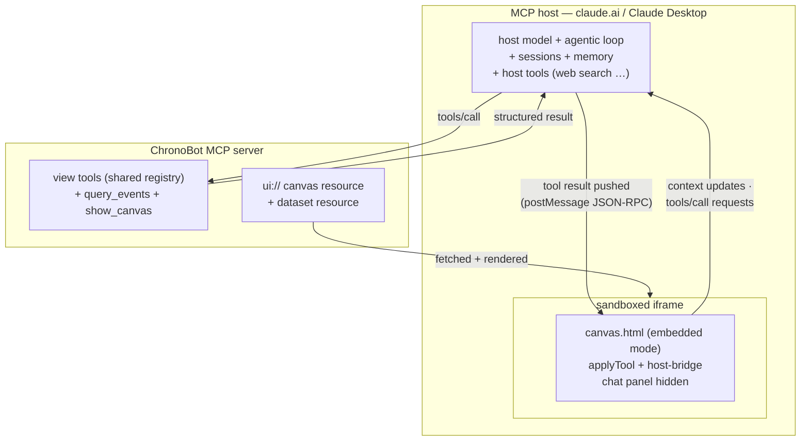
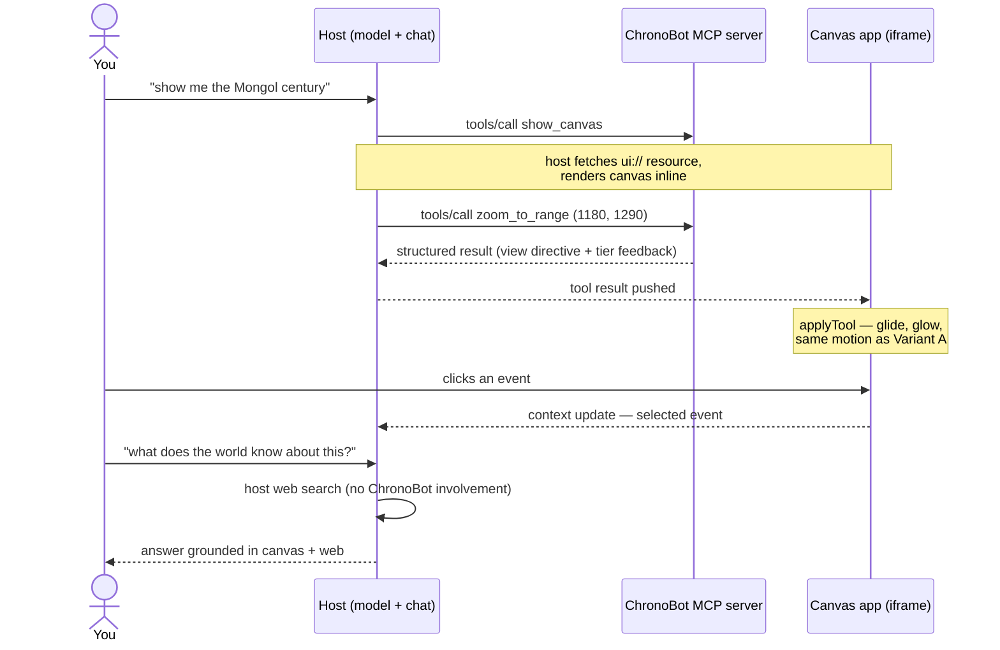

# Spec — MCP Apps variant (dual-track)

**Status: Agreed (2026-08-15) → Phase A built (2026-08-15) → Evaluated & parked (2026-08-15)**

*Real-host verdict (Claude Desktop feel-test, 2026-08-15):* it works, sort of.
The canvas renders and the tools drive it, but hosts render **each tool call as
a separate embedded result** — a fresh iframe per call, not one continuously
driven canvas. The merged full-view-state design absorbed that correctly (every
snapshot is right on its own), but the experience is wrong in a way we can't
fix: motion continuity is gone, and the app lives *inside* the chat transcript.
That inverts the product — ChronoBot is meant to be a first-class app with an
embedded chat that manipulates it, not a widget embedded in someone else's
chat. Supersession criteria 1 (animation quality) and 5 (ergonomics) fail on
host behavior outside our control, so the gate is closed and **Variant B is
parked**: Variant A stays canonical, and the eventual harness for a first-class
app with an embedded copilot is a CopilotKit-based **Variant C** (see BACKLOG —
its `useFrontendTool` hook is exactly the `applyTool` pattern, with the chat as
a component inside our page). The excursion paid for itself: `tools.mjs` (the
shared registry) and the full-state-result pattern carry forward, and
`mcp-server.mjs` remains a working zero-obligation distribution channel
(ChronoBot's tools + dataset inside any MCP host, snapshot-style rendering).
The dual-track lockstep-maintenance obligation below is ended.

*Phase A verification record:* stdio smoke test green (initialize, tools/list =
7 UI tools + query_events, `ui://` resource serves the canvas as
`text/html;profile=mcp-app`, merged view-state folds correctly across calls,
unknown-id feedback works, query_events filters correctly). Bridge verified in
a scripted fake host: handshake → dark theme from host context → full-state
glide (Mongol century, 3 highlights, ruler 1206) → `ui/update-model-context` +
`sync_view_state` reported settled state back. No-host iframe restores the chat
panel after a 2s probe (the published artifact takes this path). Variant A
regression clean, including a live streamed tool call. **Not yet exercised: a
real host** — the Claude Desktop feel-test is the next step, and the
supersession criteria remain entirely open.

*Implementation notes (deviations from the reference patterns, all deliberate):*
no vite/bundler — the canvas was already a single self-contained file with zero
external origins (no CSP domains needed), so the `ui://` resource is
`prototype/canvas.html` verbatim; the app side speaks the `ui/` postMessage
dialect directly (~120 inline lines) instead of importing the `App` class, which
would have forced a build step; view tools return the **full merged view-state**
in `structuredContent` (server folds each call into a per-process state, the
canvas applies it whole) so rendering is correct whether the host reuses the
live instance or spawns a fresh iframe — the app-only `sync_view_state` tool
closes the loop for user-driven changes; the shared registry (`tools.mjs`)
feeds both servers (`toAnthropic` / `toZodShape`).
Related: [architecture.md](../architecture.md) · research basis: MCP Apps extension
(spec `2026-01-26`, `io.modelcontextprotocol/ui`), host support matrix (claude.ai,
Claude Desktop, VS Code Copilot, ChatGPT, Cursor, …).

## Why

Canvas manipulation will not be the only tool surface ChronoBot wants — knowledge
tools (web search, knowledge-base queries) are coming, and sessions/memory
eventually. Rather than hand-roll those (the stopping rule in CLAUDE.md), this
variant packages ChronoBot as an **MCP server whose canvas is an MCP App**: the
host (claude.ai / Claude Desktop) brings the model, the agentic loop, sessions,
memory, and its own knowledge tools; ChronoBot brings what is unique — the
synchronoptic canvas and the curated dataset. The canvas is already a single
self-contained HTML file, which is exactly what a `ui://` resource wants to be.

## Dual-track policy (the governing rule)

*Outcome (2026-08-15): the gate is closed — Variant B parked per the verdict
above. The policy below is kept as the record of the rule that governed the
evaluation; the lockstep-maintenance obligation no longer applies.*

The MCP Apps variant is an **alternative, not a migration**. Both variants stay
in play until the MCP variant demonstrably supersedes the custom one:

- **Variant A — custom (canonical today):** `canvas.html` standalone +
  `server.mjs` chat proxy (DeepInfra, hand-rolled loop, SSE). Unchanged and
  fully maintained.
- **Variant B — MCP App (challenger):** a ChronoBot MCP server + the same
  canvas rendered as an embedded app inside an MCP host.
- **One canvas, not a fork:** a single `canvas.html` serves both variants via a
  host-bridge adapter (embedded mode detected at runtime). A change that fixes
  one variant must not break the other.
- **One registry, both variants:** tool names/schemas are defined once and
  imported by both servers, so the registries cannot drift (extends
  architecture invariant 2).
- Retiring Variant A is its own future decision, recorded in BACKLOG, taken
  only after the supersession criteria below all pass.

## The host, concretely

"Host" = the chat application that owns the conversation, runs the model and the
agentic loop, connects to MCP servers, and renders the app iframe. In Variant A
our own code plays this role; in Variant B it is:

- **Primary — Claude Desktop:** renders MCP Apps, connects to local (stdio) MCP
  servers including into WSL, and runs on the existing Claude subscription —
  which is what makes the no-per-token-bill claim true. The feel-test target.
- **Secondary — claude.ai (web):** renders MCP Apps but reaches servers over
  HTTPS only — requires tunneling a local server; not the first target.
- **Bonus — VS Code GitHub Copilot:** on the support matrix with local servers;
  the same ChronoBot server would render there with zero extra code (model
  billed to a Copilot subscription, if present).
- **Dev-time:** Claude Code can call the tools (no rendering — the graceful-
  degradation scenario); inspector-style hosts (e.g. MCPJam) exercise the
  rendering during development before involving Claude Desktop.

The trade this allocation makes, stated plainly: the host is software we don't
control. Its model menu, loop behavior, rate limits, and app-rendering quirks
become ChronoBot's ceiling, and the young Apps spec can shift under us. That is
the deliberate exchange — shed the harness burden, accept a platform dependency —
and it is why the dual-track policy and the supersession gate exist at all.

## Architecture (Variant B)





Key mappings from the custom variant:

| custom variant (A)                  | MCP App variant (B)                          |
|-------------------------------------|----------------------------------------------|
| `sendChat`/`chatHop` loop           | host's agentic loop (deleted from this path)  |
| chat sidebar                        | host's chat (panel hidden in embedded mode)  |
| `<view_state>` message prefix       | context updates via the ui/ postMessage dialect |
| full dataset in system prompt       | `query_events` tool + dataset resource       |
| `applyTool` switch                  | unchanged — fed by host messages instead     |
| DeepInfra + `.env`                  | host model (subscription; no per-token bill) |

New tools (Variant B only, added to the shared registry with `_meta.ui` where apt):

- **`show_canvas`** — entry point; declares the `ui://` canvas resource so the
  host renders it.
- **`query_events`** — dataset grounding for a host model that does not carry
  the dataset in its prompt: filter by year range / region / theme / tier / text;
  returns event lines. (The host can also read the dataset resource whole.)

## Features and scenarios

```gherkin
Feature: Canvas renders and operates as an MCP App
  Background:
    Given the ChronoBot MCP server is connected to an MCP Apps-capable host

  Scenario: The canvas appears in conversation
    When the user asks to see the chart and the model calls show_canvas
    Then the host renders the canvas inline in the conversation
    And the canvas shows the full poster view (199 events, all lanes)

  Scenario: View tools drive the embedded canvas with motion parity
    When the model calls zoom_to_range for 1180-1290
    Then the embedded canvas glides to that range exactly as Variant A does
    And the tool result reports the detail tiers now visible

  Scenario: Deixis — clicking an event reaches the model
    When the user clicks "Genghis Khan" on the embedded canvas
    Then a context update carries the selected event id and title to the model
    And the model can discuss "this" without the user naming it

  Scenario: Host knowledge tools compose with the canvas
    Given the host has web search available
    When the user asks a question beyond the dataset
    Then the host answers via its own tools with the canvas view intact
    And ChronoBot code was not involved in the knowledge retrieval

  Scenario: Dataset grounding without a dataset-bearing prompt
    When the model needs events for a region and era it hasn't seen
    Then it calls query_events and receives matching event lines
    And its narration references real ids (verified against the canon)

  Scenario: Standalone mode is unaffected (dual-track guard)
    When canvas.html is opened directly (file:// or server.mjs)
    Then the chat sidebar, DeepInfra loop, and all Variant A behavior
      work exactly as before, with no MCP code in the path

Feature: Graceful degradation
  Scenario: Tool-only host (no Apps rendering, e.g. a CLI)
    Given a host that supports MCP tools but not the Apps extension
    When the model calls view tools
    Then tools return structured results without error
    And show_canvas explains the canvas requires an Apps-capable host
```

## Supersession criteria (gate for retiring Variant A)

*Scored 2026-08-15: criteria 1 and 5 failed structurally (fresh iframe per tool
call in most hosts — no motion continuity, app-inside-chat ergonomics). The
remaining criteria were not pursued further; the gate cannot pass.*

All must pass, judged in real use, before Variant A retirement is even proposed:

1. **Tool parity** — all five view tools operate the embedded canvas with the
   same animation quality as Variant A.
2. **Deixis parity** — click-to-select context reaches the model reliably.
3. **Grounding parity** — the model answers dataset questions (ids, dates,
   synchronicities) at least as well via query_events/resource as Variant A does
   with the full dataset in-prompt.
4. **The Mongol-century benchmark** — the multi-hop story turn (zoom + filter +
   highlights + ruler + narration) matches or beats the Variant A live run.
5. **Ergonomics** — poster-inside-chat passes a feel-test against
   chat-beside-poster: canvas size, expandability, and scan-ability are
   acceptable for real reading sessions.
6. **The composition win is real** — at least one genuine session combining host
   knowledge tools (web search / other MCP servers) with the canvas, something
   Variant A cannot do.
7. **Cost & stability** — runs on the existing Claude subscription without
   per-token anxiety; host quirks (iframe sizing, app persistence across a
   conversation) are livable.

Until then: bugs are fixed in both variants; new view tools land in the shared
registry and are exercised in both.

## Build plan (Phase A, after this spec is Agreed)

1. Extract the shared tool registry (schemas) from server.mjs into a module both
   servers import.
2. `mcp-server.mjs` — MCP server (official SDK): shared view tools +
   `show_canvas` + `query_events`, canvas as `ui://` resource, dataset as a
   resource.
3. Host-bridge adapter in canvas.html: detect embedded mode, hide chat panel,
   route host messages → `applyTool`, emit selection/view context updates.
4. Feel-test in Claude Desktop; verify scenarios; record results against the
   supersession criteria in this spec.

## Out of scope (this version)

- Retiring anything from Variant A (that is the gate above, not this build).
- Knowledge management / dataset writes (separately deferred —
  [promotion-workflow.md](promotion-workflow.md)).
- CopilotKit — deliberately not adopted in this build. *(Post-verdict update:
  promoted from "convergence path if ever hosted" to the designated **Variant C**
  — the harness for a first-class app with embedded chat. See BACKLOG; it gets
  its own spec before any build.)*
- Custom host features (sessions UI, memory) — the entire point is the host
  provides them.
