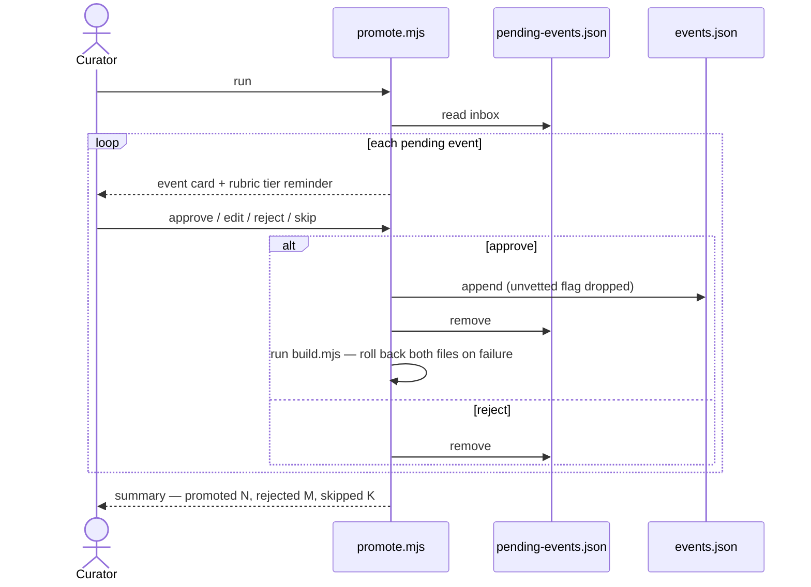

# Spec — Realtime AI event additions (add → vet → promote)

**Status: Deferred (2026-08-15)**
History: realtime `add_events` v1 built 2026-07-25 · this promotion spec Proposed
2026-08-15 · same day, the whole concept was deferred and the v1 machinery removed
from the codebase.
Related: [architecture.md](../architecture.md) → "Knowledge management" ·
[significance-rubric.md](../significance-rubric.md) → "Vetting"

*Scope note (2026-08-15, clarified in review): this spec covers **one channel**
of knowledge management — AI-proposed events entering the canon at runtime. The
domain itself is broader: all knowledge the app uses — the curated canon and its
growth, the rubric that governs entry, the event schema (sources, vetting),
how knowledge is delivered to the model, and future retrieval (web search,
knowledge bases). The domain map lives in architecture.md; the eventual
"sophisticated take" should be designed at domain level, with this record as
one input to it.*

## Why deferred

The v1 experiment (copilot `add_events` tool → dashed "unvetted" rendering →
`data/pending-events.json` inbox → hand promotion into canon) worked mechanically,
but it answered the easy half of the question. How AI-proposed knowledge should
enter the product, be vetted, carry sources, and graduate into the canon is a
knowledge-management design problem that deserves a considered take — not a
bolt-on tool plus a CLI. Rather than let a half-baked pipeline shape the data
model and the prompt, the whole concept is parked: **the model currently cannot
write to the dataset at all**, and that is a design decision, not a gap.

What this spec preserves: the v1 scenarios (below) as a record of the thinking,
and the experiment's sample output (appendix) — six Mongol-century events the
copilot authored in real use, with honest tier judgments. Both are inputs to the
future design, whenever usage demands it.

## Reopening criteria

Revisit when one of these becomes true in real use:

- Dataset gaps are the recurring frustration of sessions (the copilot keeps
  saying "not on the canvas" for things you want to see), or
- the curated-spine strategy (CONCEPT.md) reaches its manual-curation limit, or
- a sources/citation model lands (the rubric's vetting bar), giving promotion
  something rigorous to promote *to*.

The future design should answer, at minimum: provenance and sources at entry;
where proposed knowledge lives (separate tier? separate store?); how vetting
happens (in-flow? batch? in-canvas?); what the model is told about unvetted
knowledge; and whether "adding events" is even the right grain (vs. adding
threads, notes, or sources).

## The v1 scenarios (historical record)

Kept as written when this was Proposed — they describe the CLI that was never
built, over machinery that has since been removed.

```gherkin
Feature: Curator reviews the pending-events inbox
  The curator walks pending events one at a time and decides each one's fate.
  Promotion is the only path from inbox to canon.

  Scenario: Approve a pending event
    Given the inbox contains "golden-horde" marked unvetted
    When the curator approves it
    Then it is appended to data/events.json without the "unvetted" flag
    And removed from the inbox, and build.mjs validation passes

  Scenario: Reject a pending event
    When the curator rejects an event
    Then it is removed from the inbox and the canon is unchanged

  Scenario: Edit, then approve
    When the curator edits tier or dates before approving
    Then the promoted event carries the edited values

  Scenario: Validation failure aborts safely
    Given a pending event that would fail canon validation
    When the curator approves it
    Then the canon change is rolled back and the event stays in the inbox

  Scenario: Empty inbox
    Then promote.mjs prints "inbox empty" and exits without touching files
```



## Appendix — v1 sample output

The six events the copilot added during the 2026-08-15 Mongol-century session
(the inbox's full contents when the experiment was retired). Preserved because
the tier judgments were honest (2s and 3s, no grade inflation) — useful calibration
data for the future design, and candidates for ordinary manual curation into the
canon meanwhile:

```json
[
  {"id":"mongol-invasions","title":"Mongol invasions of Khwarezmia","short":"Khwarezmia invaded","start":1219,"end":1221,"circa":false,"region":"middle-east","themes":["war"],"tier":2},
  {"id":"genghis-death","title":"Death of Genghis Khan","short":"Genghis dies","start":1227,"circa":false,"region":"asia.steppe","themes":["politics"],"tier":2},
  {"id":"mongol-europe","title":"Mongol invasion of Europe","short":"Mongols reach Europe","start":1241,"end":1242,"circa":false,"region":"europe","themes":["war"],"tier":2},
  {"id":"mongol-empire-split","title":"Mongol Empire divides into khanates","short":"Empire splits","start":1259,"circa":false,"region":"asia.steppe","themes":["politics"],"tier":2},
  {"id":"ilkhanate-founded","title":"Ilkhanate founded in Persia","short":"Ilkhanate begins","start":1256,"circa":false,"region":"middle-east","themes":["politics"],"tier":3},
  {"id":"golden-horde","title":"Golden Horde rules the Rus'","short":"Golden Horde","start":1242,"circa":false,"region":"asia.steppe","themes":["politics"],"tier":3}
]
```
